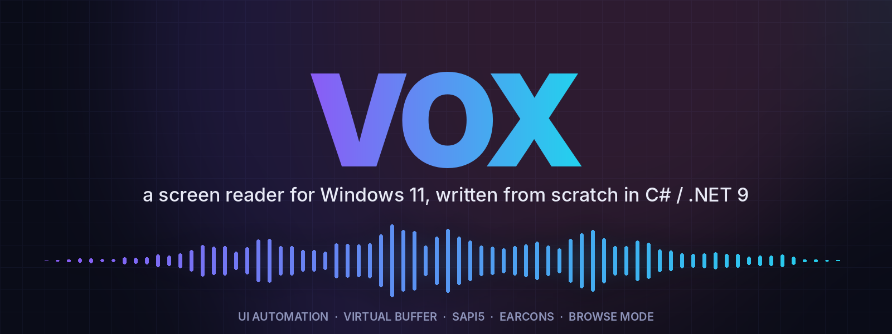
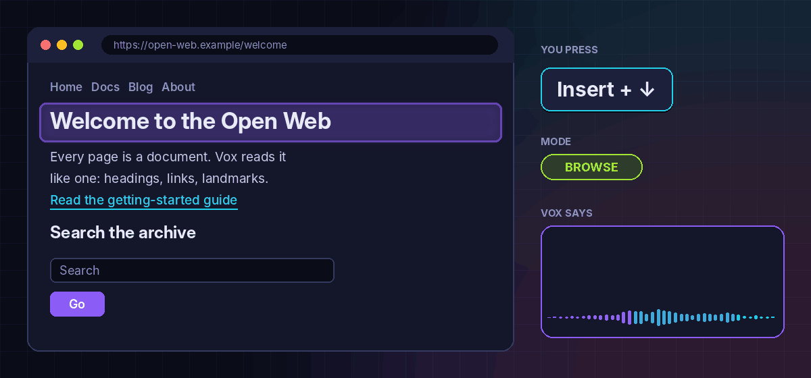
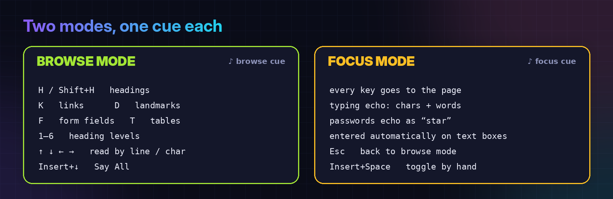
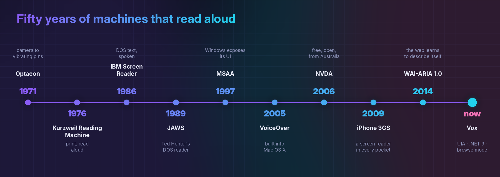
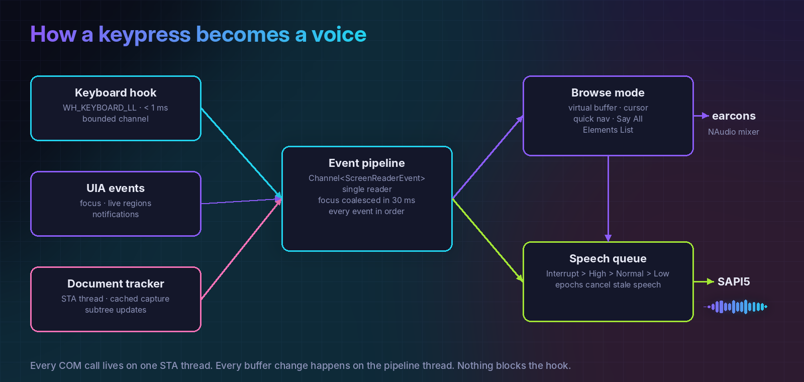

<p align="center">
  
</p>

<p align="center">
  
  
  
  
  
</p>

<p align="center"><b><i>The web, read aloud. Fast, keyboard-first, open source.</i></b></p>

---

Close your eyes and open a web page.

There's no layout and no colour, and nothing to glance at. A page becomes a **stream of
sound**: a heading, a link, a paragraph that runs on, a search box waiting for you. To move
around it you need something that turns the screen into speech and the keyboard into a
cursor, with no lag. That something is a **screen reader**. Millions of people use one for
every minute they spend on a computer.

**Vox** is a new screen reader for Windows 11, built from the ground up in modern C#. It
listens to Windows through **UI Automation**, turns web pages into a navigable **virtual
buffer**, and talks back through **SAPI5** speech, with short **earcons** for mode changes
and boundaries. It's built to be fast and easy to hack on.

<p align="center">
  
</p>

<p align="center"><sub>Illustration of a browse-mode session: the key you press, where the virtual cursor lands, and what Vox says.</sub></p>

---

## ✦ What it does today

| | |
|---|---|
| 🌐 **Browse mode for Edge & Chrome** | Each page becomes a virtual document you read by line, word, character or paragraph, even text no keyboard focus can reach. |
| ⚡ **Single-key quick nav** | `H` headings, `K` links, `D` landmarks, `F` form fields, `T` tables, `1`–`6` heading levels. Add `Shift` to go backwards. |
| 🎯 **Automatic focus mode** | Tab into a text box and your keys go to the page. A short cue tells you; there's no chatter. `Esc` takes you back. |
| 🗣️ **Say All** | `Insert`+`↓` reads from the cursor to the end of the page. The cursor follows along, so it stops where you stopped listening. |
| 📋 **Elements List** | `Insert`+`F7` opens every heading, link, landmark and form field in a filterable list, then jumps to the one you pick. |
| 📣 **Live regions & notifications** | Chat messages, "Saved!", toasts. Polite updates are throttled, assertive ones cut through, and background apps stay quiet. |
| ⌨️ **Typing echo** | Characters, words or both, in your real keyboard layout (dead keys and AltGr included). Passwords echo as "star". |
| 🎚️ **Three verbosity levels** | *Beginner* says everything, *Advanced* says just enough. A talking first-run wizard sets rate, voice, verbosity and modifier key. |
| 🔁 **Live pages** | Pages that change under you are re-captured incrementally. The cursor stays on the same character, and each page remembers where you were. |

<p align="center">
  
</p>

---

## ✦ A short history of computers that talk

<p align="center">
  
</p>

**Before speech, there was touch.** In 1971 the **Optacon** went on sale. Stanford engineer
John Linvill designed it after his daughter Candy lost her sight. A tiny camera passed over
printed text, and a grid of vibrating pins raised each letter's shape under a fingertip. It
was slow and took months to learn, but for the first time ordinary print could be read
without a sighted helper.

**Then machines started reading aloud.** In 1976 Ray Kurzweil unveiled the **Kurzweil
Reading Machine**, a flatbed scanner, an omni-font OCR engine and a speech synthesizer the
size of a washing machine. It read books out loud. Stevie Wonder famously bought one of the
first.

**Then the PC arrived, and someone had to make it talk.** In 1986 IBM's **Screen Reader**
for DOS read the text-mode screen through a speech synthesizer and a dedicated keypad. It
was the work of Jim Thatcher, a mathematician who spent the rest of his career on
accessibility. In 1989 Ted Henter, a motorcycle racer blinded in a car crash, shipped
**JAWS** ("Job Access With Speech"). JAWS went on to become the dominant commercial screen
reader for decades.

**Then the GUI broke everything.** DOS screens were text in memory, so a screen reader just
read them. Windows *drew* its text as pixels, which left nothing to read. Screen readers
fought back with *off-screen models*: they intercepted every drawing call and rebuilt the
screen as text behind the scenes. It was heroic, fragile work. Microsoft answered in 1997
with **Active Accessibility (MSAA)**, so applications could *describe* themselves to
assistive tech. Its successor, **UI Automation**, arrived with Windows Vista, and Vox is
built on it.

**Then came the web, the hardest UI of all.** Pages aren't windows full of controls. They're
long documents with links, headings and forms scattered through them. Screen readers
responded with the **virtual buffer**: they copy the page into a flat document the user can
arrow through like a word processor, with single-letter keys to jump between elements. The
idea of *browse mode* and *focus mode* comes from this era, and it's still the best answer we
have.

**Then screen readers got free.** In 2005 Apple built **VoiceOver** into Mac OS X, so the
reader came with the computer rather than a large licence fee. In 2006 Michael Curran, a
blind student in Australia, started **NVDA** (NonVisual Desktop Access), a free, open-source
Windows screen reader written in Python. It's now one of the most widely used screen readers
in the world. In 2009 the **iPhone 3GS** put a screen reader into every pocket, with
gestures in place of a keyboard. And in 2014 **WAI-ARIA 1.0** became a W3C Recommendation,
which gave web developers a standard way to tell assistive tech what their widgets are and
what state they're in.

**Now there's Vox.** Same lineage, new engine: native UI Automation, a typed and tested core,
and an event pipeline designed for the web as it is today, with single-page apps, live
regions and pages that never stop changing.

---

## ✦ How it works

<p align="center">
  
</p>

Everything Vox hears goes into **one ordered pipeline**, and everything it says comes out of
**one priority queue**:

- **Keyboard hook.** A `WH_KEYBOARD_LL` hook that does almost nothing, on purpose: Windows
  silently unhooks a slow hook, so the callback only records modifier state, decides whether
  to swallow the key, and posts it to a channel in under a millisecond.
- **UI Automation.** Every COM call goes through one dedicated STA thread. Event callbacks
  just post to the pipeline and return.
- **Virtual buffer.** When focus enters a Chromium or Gecko document, Vox captures the whole
  tree in **one cached UIA call** and copies it into a COM-free snapshot. It then builds a flat
  text buffer with prebuilt indices for headings, links, landmarks, form fields and tables.
  Structure changes are debounced and spliced in incrementally. Old snapshots are never
  mutated.
- **Speech queue.** Priorities `Interrupt > High > Normal > Low`. Every interrupt starts a new
  *epoch*: whatever was playing stops at once, and anything queued before it is dropped, so
  you never hear stale speech.
- **Earcons.** One NAudio mixer stays open while cues play, so mode, boundary and wrap sounds
  start instantly and overlap cleanly.

Every component sits behind an interface (`ISpeechEngine`, `IKeyboardHook`, `IEventSink`,
`IAudioCuePlayer`, `IVBufferElement`), so the core logic is covered by **700+ unit tests**
that never need a real screen, voice or browser.

---

## ✦ Keys

`Insert` is the Vox key (you can switch it to `Caps Lock` in setup). Tap it twice quickly to
use its normal function.

| Browse mode | |
|---|---|
| `↑` `↓` | previous / next line |
| `←` `→` | previous / next character |
| `Ctrl`+`←` `→` | previous / next word |
| `Ctrl`+`↑` `↓` | previous / next paragraph |
| `Home` / `End` | start / end of line |
| `Ctrl`+`Home` / `Ctrl`+`End` | top / bottom of page |
| `H` · `K` · `D` · `F` · `T` | next heading · link · landmark · form field · table |
| `1`–`6` | next heading at that level |
| `Shift` + any of the above | the same, backwards |
| `Enter` / `Space` | activate the element under the cursor |

| Anywhere | |
|---|---|
| `Insert`+`Space` | toggle browse / focus mode |
| `Esc` *(focus mode)* | back to browse mode |
| `Insert`+`↓` | Say All |
| `Insert`+`↑` | read the current line |
| `Insert`+`Ctrl`+`↑` | read the current word |
| `Insert`+`F7` | Elements List |
| `Ctrl` | stop speech |
| `Insert`+`Ctrl`+`S` | run the setup wizard again |
| `Insert`+`Q` *(twice)* | quit Vox |

Every binding lives in [`assets/config/default-keymap.json`](assets/config/default-keymap.json)
and follows NVDA's conventions, so your muscle memory carries over.

---

## ✦ Get it running

You'll need **Windows 11**, the **[.NET 9 SDK](https://dotnet.microsoft.com/download/dotnet/9.0)**,
and Edge or Chrome 126+.

```bash
git clone https://github.com/ChrisBrooksbank/Vox.git
cd Vox

dotnet build                          # build the solution
dotnet test                           # run the test suite
dotnet run --project src/Vox.App      # start talking (run as administrator for the keyboard hook)
```

On first launch a **spoken setup wizard** walks you through speech rate, voice, verbosity and
modifier key. Press `Esc` to skip it. You can bring it back any time with
`Insert`+`Ctrl`+`S`.

**Settings** live in `%APPDATA%\Vox\settings.json` and reload live as you edit them:

```jsonc
{
  "VerbosityLevel": "Beginner",     // Beginner | Intermediate | Advanced
  "SpeechRateWpm": 200,             // 150–450
  "VoiceName": null,                // null = best installed voice
  "TypingEchoMode": "Both",         // None | Characters | Words | Both
  "AudioCuesEnabled": true,
  "AnnounceVisitedLinks": true,
  "ModifierKey": "Insert",          // Insert | CapsLock
  "MaxLineLength": 100,             // long lines are split at a word boundary (0 = never)
  "FirstRunCompleted": true
}
```

Logs go to `%APPDATA%\Vox\logs\`.

---

## ✦ Inside the repo

```
src/
├── Vox.Core/            # everything that matters, unit-tested
│   ├── Accessibility/   #   UIA thread, event subscriber, document tracker, live regions
│   ├── Buffer/          #   virtual buffer: builder, document, cursor, incremental updater
│   ├── Navigation/      #   browse-mode controller, quick nav, Say All, Elements List
│   ├── Input/           #   keyboard hook, keymap, dispatcher, typing echo
│   ├── Pipeline/        #   the event pipeline and its event records
│   ├── Speech/          #   priority speech queue, SAPI5 engine
│   ├── Audio/           #   earcon mixer
│   └── Configuration/   #   settings, verbosity profiles, first-run wizard
└── Vox.App/             # host, DI wiring, the one IHostedService
tests/Vox.Core.Tests/    # xUnit + Moq, mirrors Vox.Core's layout
assets/                  # default keymap, default settings, earcon .wav files
specs/                   # per-subsystem requirements
docs/images/             # the pictures in this README
```

---

## ✦ Where it's going

- **Phase 1, now: "read a web page, for real".** Browse and focus modes, quick nav, Say All,
  Elements List, live regions, typing echo, verbosity, first-run wizard.
- **Phase 2: robust desktop and braille.** Braille displays, object navigation in any app,
  review cursor, find in page, app modules, a settings dialog, system tray.
- **Phase 3: performance and reach.** A native IAccessible2 helper, richer table navigation,
  Firefox, and AI image descriptions.

The full roadmap is in [PLAN.md](PLAN.md). Per-subsystem requirements are in [`specs/`](specs/),
and the task checklist is in [IMPLEMENTATION_PLAN.md](IMPLEMENTATION_PLAN.md).

---

## ✦ Contributing

Screen readers are personal. Every user has habits, workarounds and pet peeves, and the best
features come from people who use one all day. Bug reports, keymap ideas and pull requests are
all welcome.

Before you open a PR:

```bash
dotnet build && dotnet test    # both must pass
```

Some house rules: keep the keyboard hook callback under 1 ms, keep every UIA call on the UIA
thread, put new key bindings in the keymap JSON (not in code), and add a test for each
behaviour you change. [CLAUDE.md](CLAUDE.md) and [AGENTS.md](AGENTS.md) cover the architecture
in more depth.

---

<p align="center">
  <b>MIT licensed.</b> Built for the people who hear the web.<br>
  <sub>“The power of the Web is in its universality. Access by everyone regardless of disability is an essential aspect.” — Tim Berners-Lee</sub>
</p>
